# Домашнее задание по Docker

**Студент:** Демин Илья Викторович

---

# Содержание

1. [Задача 1](#задача-1)
2. [Задача 2](#задача-2)
3. [Задача 3](#задача-3)
4. [Задача 4](#задача-4)
5. [Задача 5](#задача-5)

---

# Задача 1

## Dockerfile

```dockerfile
FROM nginx:1.29.0

COPY index.html /usr/share/nginx/html/index.html
```

## index.html

```html
<html>
<head>
Hey, Netology
</head>
<body>
<h1>I will be DevOps Engineer!</h1>
</body>
</html>
```

## Используемые команды

```bash
docker pull nginx:1.29.0

docker build -t custom-nginx:1.0.0 .

docker tag custom-nginx:1.0.0 iliademin/custom-nginx:1.0.0

docker push iliademin/custom-nginx:1.0.0
```

## Docker Hub

### Образ в Docker Hub

!https://hub.docker.com/repository/docker/iliademin/custom-nginx/general

---

# Задача 2

## Запуск контейнера

```bash
docker run -d --name "DeminIlyaViktorovich-custom-nginx-t2" -p 127.0.0.1:8080:80 my-nginx:1.0.0
```

## Переименование контейнера

```bash
docker rename "DeminIlyaViktorovich-custom-nginx-t2" custom-nginx-t2
```
### Скриншоты

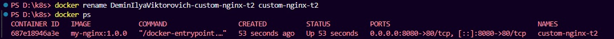

## Проверка

```bash
date +"%d-%m-%Y %T.%N %Z"

docker ps

ss -tlpn | grep 127.0.0.1:8080

docker logs custom-nginx-t2 -n1

docker exec -it custom-nginx-t2 base64 /usr/share/nginx/html/index.html

curl http://127.0.0.1:8080
```

## Скриншоты

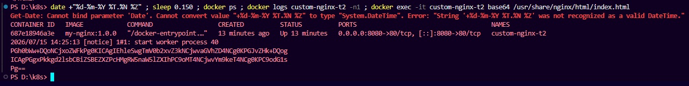
---

# Задача 3

## Подключение к потокам контейнера

```bash
docker attach custom-nginx-t2
```

После нажатия **Ctrl+C** контейнер остановился.

### Почему контейнер остановился?

Контейнер завершил работу, поскольку основной процесс (PID 1), запущенный внутри контейнера, получил сигнал SIGINT. Когда завершается главный процесс контейнера, Docker автоматически останавливает контейнер.

### Скриншоты
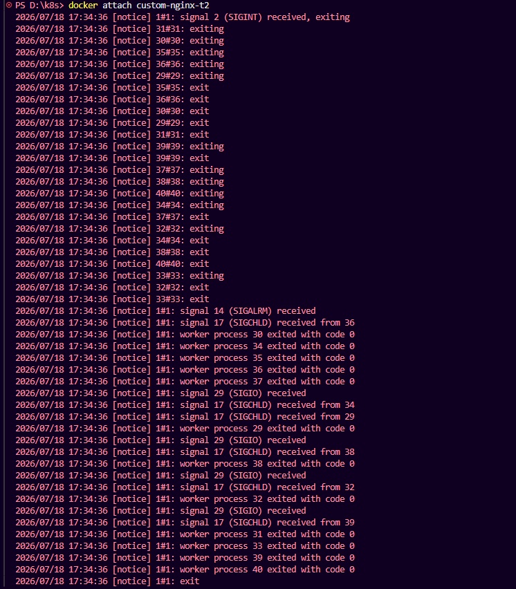

---

## Перезапуск

```bash
docker start custom-nginx-t2
```
### Скриншоты
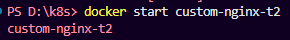

---

## Подключение к контейнеру

```bash
docker exec -it custom-nginx-t2 bash
```
### Скриншоты
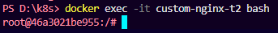

---

## Установка редактора

```bash
apt-get update

apt-get install nano -y
```
### Скриншоты
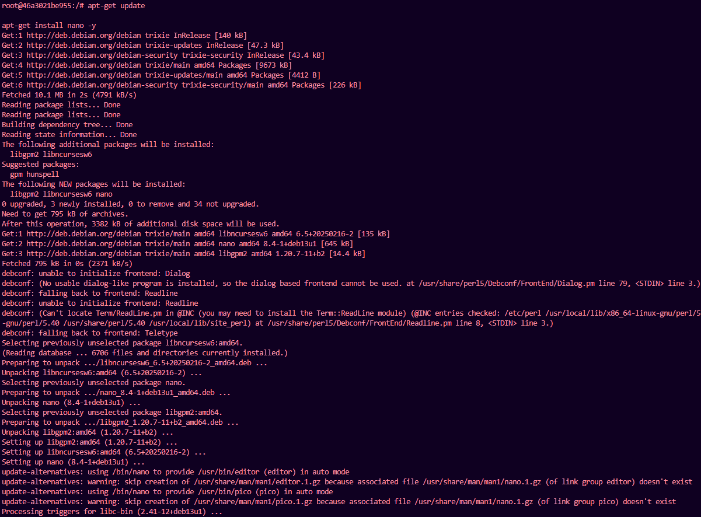

---

## Изменение конфигурации nginx

```bash
nano /etc/nginx/conf.d/default.conf
```

Изменен порт

```
listen 80;
```

на

```
listen 81;
```
### Скриншоты
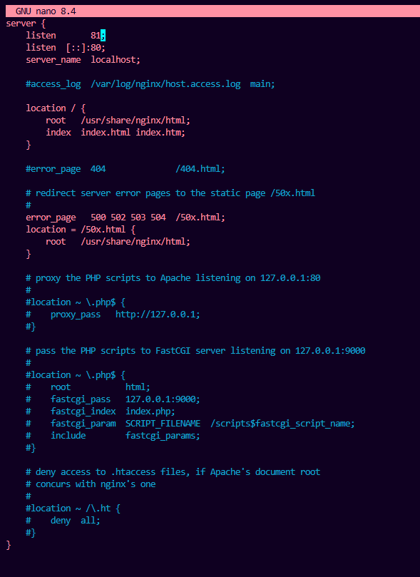

---

## Перезагрузка nginx

```bash
nginx -s reload
```

---

## Проверка

```bash
curl http://127.0.0.1:80

curl http://127.0.0.1:81
```
### Скриншоты
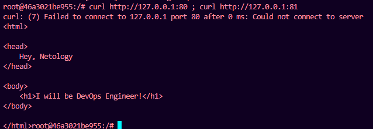

---

## Проверка на хосте
Задание делал в Docker Desktop, пришлось немного модифицировать первый запрос под PowerShell.
```bash
ss -tlpn | grep 127.0.0.1:8080

docker port custom-nginx-t2

curl http://127.0.0.1:8080
```
### Скриншоты
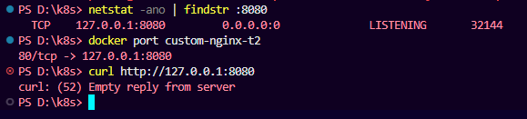

### Почему перестал работать порт 8080?

Docker продолжает перенаправлять порт хоста 8080 на порт 80 контейнера. После изменения конфигурации nginx сервер начал слушать порт 81, поэтому запросы перестали доходить до nginx.

---

## Удаление контейнера

```bash
docker rm -f custom-nginx-t2
```
### Скриншоты
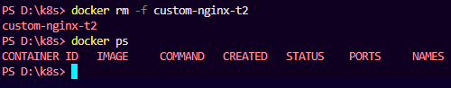

---

# Задача 4

## Запуск контейнеров
Вновь адаптация под  PowerShell - PWD 
```bash
docker run -d --name centos-1 -v $(PWD):/data centos:7 tail -f /dev/null

docker run -d --name debian-1 -v $(PWD):/data debian tail -f /dev/null
```

---

## Создание файла

```bash
docker exec -it centos-1 bash

echo "Hello from DevOps" > /data/test.txt
```

---

## Проверка во втором контейнере

```bash
docker exec -it debian-1 bash
cat /data/test.txt
cd /data
ls -l

```

### Скриншоты
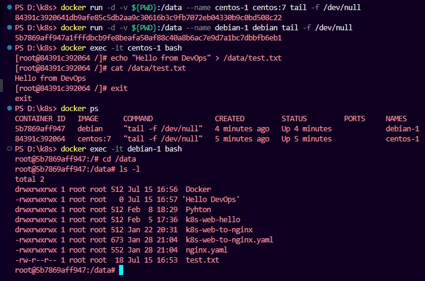

---

# Задача 5

## compose.yaml

```yaml
version: "3"

include:
  - docker-compose.yaml

services:
  portainer:
    network_mode: host
    image: portainer/portainer-ce:latest
    volumes:
      - /var/run/docker.sock:/var/run/docker.sock
```

---

## docker-compose.yaml

```yaml
version: "3"

services:
  registry:
    image: registry:2

    ports:
      - "5000:5000"
```

---

## Почему был запущен compose.yaml?

По умолчанию команда `docker compose up` ищет файл `compose.yaml`. Поэтому именно этот файл был использован первым.

---
## Отредактируйте файл compose.yaml так, чтобы были запущенны оба файла**
### Скриншоты
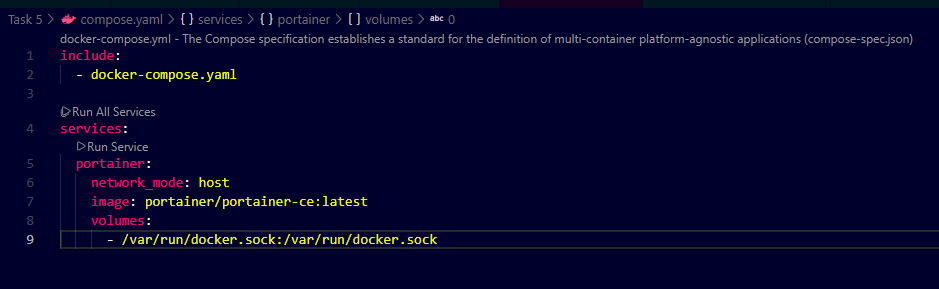
--

## Почему после include запустились оба сервиса?

Директива `include` подключает содержимое второго compose-файла. После объединения файлов Docker Compose рассматривает их как один проект и запускает сервисы из обоих файлов.

---

## Загрузка образа в локальный Registry

```bash
docker tag my-nginx:1.0.0 localhost:5000/my-nginx:latest

docker push localhost:5000/my-nginx:latest
```
### Скриншоты
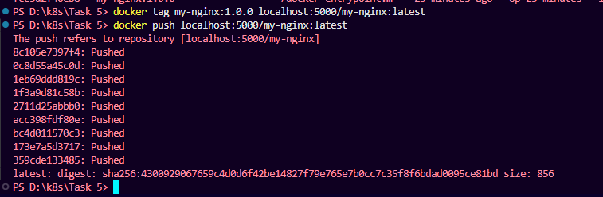
---

## Настройка Portainer

Выполнена первоначальная настройка администратора.

### Скриншот

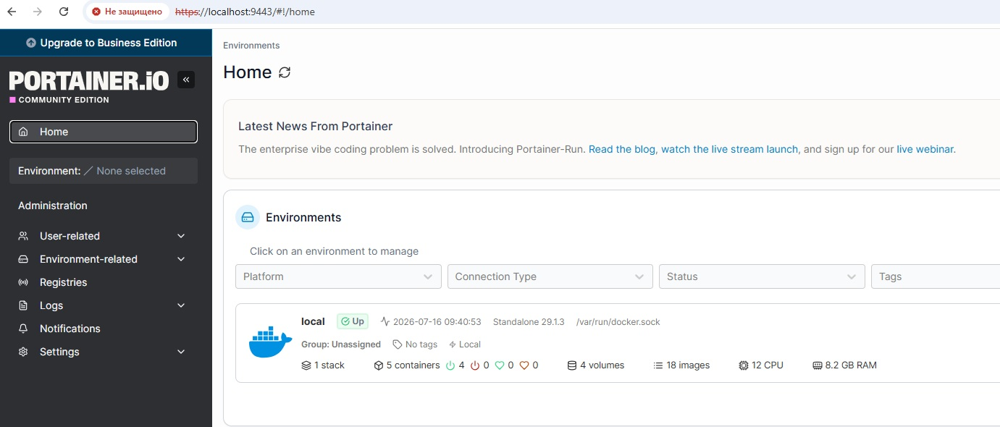

---

## Deploy Stack

```yaml
version: '3'

services:
  nginx:
    image: 127.0.0.1:5000/custom-nginx

    ports:
      - "9090:80"
```

### Скриншот

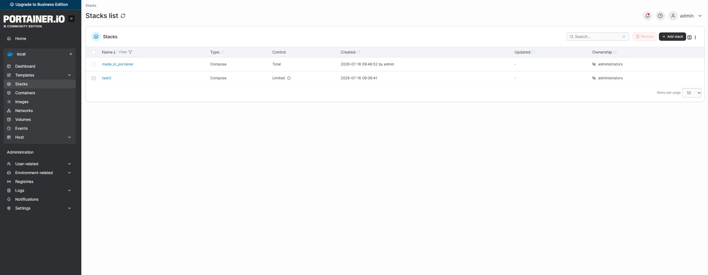

---

## Inspect контейнера

Скриншот раздела Config.

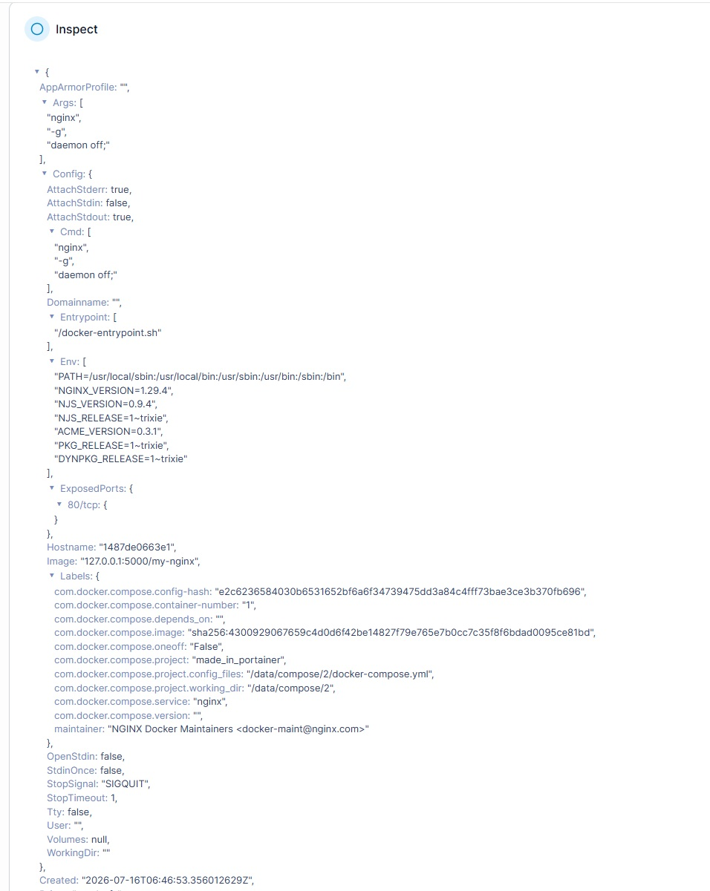

---

## Проверка compose после удаления compose.yaml

После удаления одного из compose-файлов была выполнена команда

```bash
docker compose up -d
```

Compose обнаружил контейнеры, созданные предыдущей конфигурацией, которые отсутствуют в текущем compose-проекте (orphan containers), и вывел предупреждение.

Для удаления контейнеров была выполнена команда

```bash
docker compose up -d --remove-orphans
```

---

## Завершение работы compose-проекта

```bash
docker compose down
```

---

## Скриншоты
